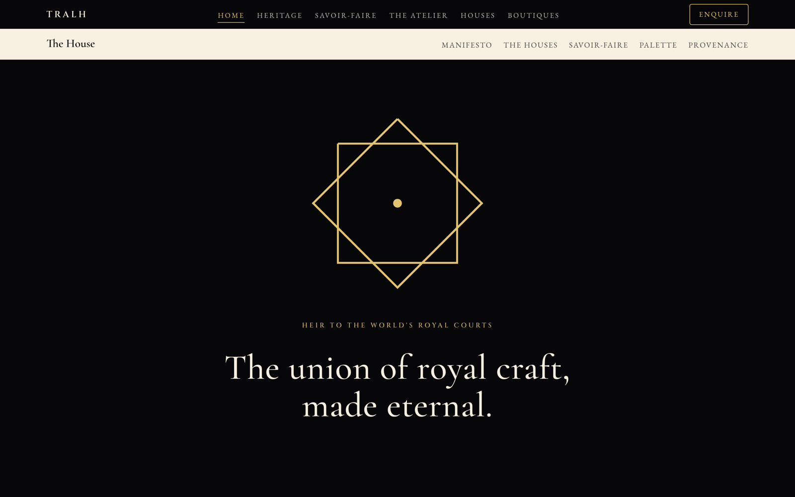
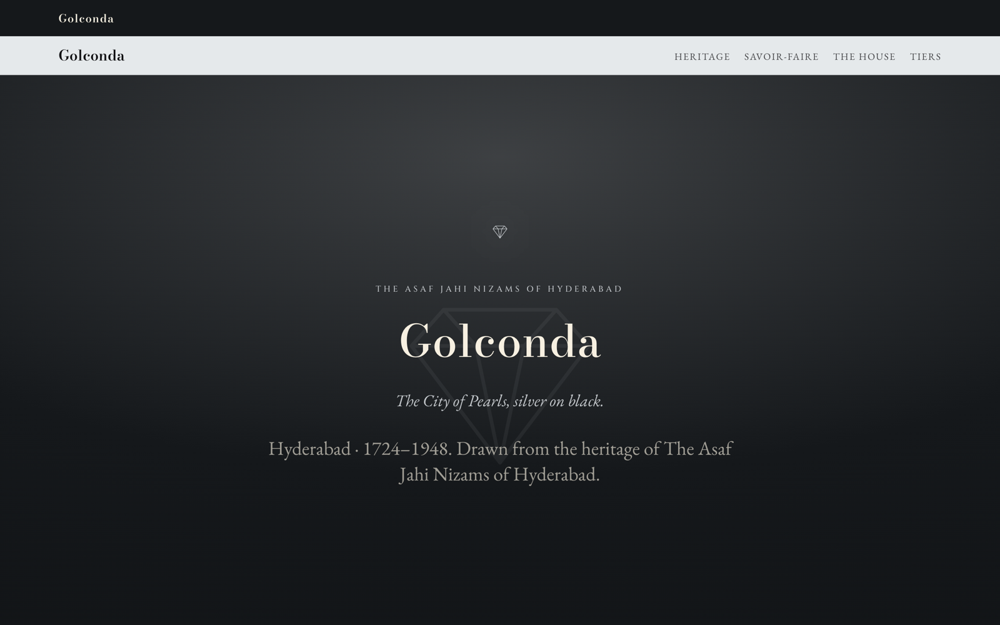

# TRALH — The Royal Authentic Luxury House

Static brand site for The Royal Authentic Luxury House: one house identity, three tiers and 21 maisons, each drawn from a historic royal court.

**Live:** https://sandeepvijayarao09.github.io/tralh/



## Highlights

- Plain HTML, CSS and JavaScript. No framework, no build step, no dependencies.
- Apple-style page structure (full-bleed alternating tiles, low density, a single accent) re-skinned in the House's Sovereign palette and serif typography (Cormorant Garamond, EB Garamond, Cinzel; Bodoni Moda on the maison pages).
- Design tokens in `css/tokens.css`, with a separate maison template (`css/maison.css`) that each of the 21 maison pages re-themes.
- Restrained scroll reveals that respect `prefers-reduced-motion`. With JavaScript off, everything still renders (reveals are gated behind a `.js` class).
- A link checker (`scripts/check_links.py`) runs in CI on every push and verifies every local link, asset and `#anchor` across all 30 pages.



## Pages

| Page | File |
|---|---|
| Home | `index.html` |
| The House (manifesto, palette, provenance) | `the-house.html` |
| Heritage | `heritage.html` |
| Savoir-Faire | `maisons.html` |
| The Royal Houses (index of all maisons) | `houses.html` |
| Boutiques & Salons | `boutiques.html` |
| Tier I — Sovereign | `sovereign.html` |
| Tier II — Flagship | `flagship.html` |
| Tier III — Signature | `signature.html` |
| 21 maison pages | `maison-*.html` (Aranjuez, Diriyah, Fatehpur, Garuda, Golconda, Gondar, Gyeongbok, Khanjar, Kiku, Le Rocher, Liwa, Muharraq, Peterhof, Sandringham, Schönbrunn, Seif, Shindagha, Sika, Surya, Tafilalt, Zubarah) |

## Structure

```
*.html             30 pages (9 site pages + 21 maison pages)
css/tokens.css     Colour, type and spacing tokens
css/base.css       Reset and base typography
css/components.css Nav, tiles, cards, buttons
css/maison.css     Shared maison page template
css/motion.css     Scroll reveals and transitions (reduced-motion aware)
css/responsive.css Breakpoints
js/main.js         Mobile nav and scroll reveals (progressive enhancement)
assets/            Imagery
scripts/check_links.py  Local link and anchor checker used by CI
```

## Run locally

```bash
git clone https://github.com/sandeepvijayarao09/tralh.git
cd tralh
python3 -m http.server 8080
# open http://localhost:8080
```

Check links before pushing:

```bash
python3 scripts/check_links.py
```

## Deployment

GitHub Pages serves the `main` branch from the repository root. Pushing to `main` updates the live site.

## License

Copyright © 2026 Sandeep Vijayarao. All rights reserved. The TRALH name, marks, copy, imagery and design are not licensed for reuse. See [LICENSE](LICENSE).
